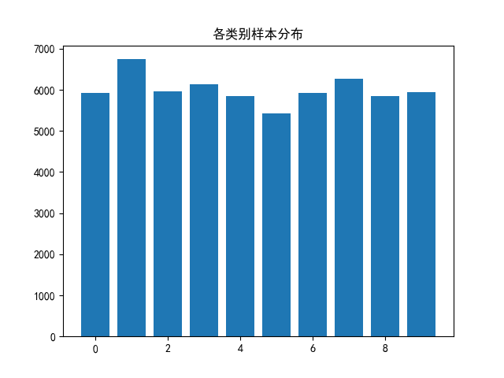
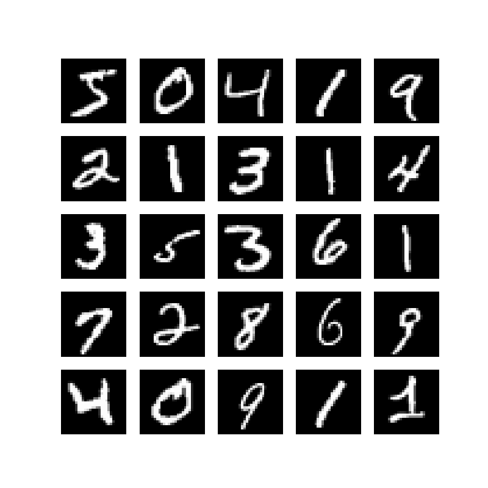
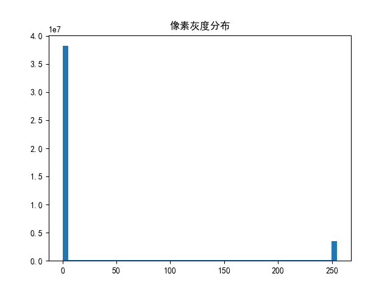

# MNIST 手写数字数据集数据分析项目

##  项目简介
本项目基于经典的 **MNIST 手写数字数据集**，使用 `numpy`、`pandas`、`matplotlib` 等 Python 工具，完成对数据集的**探索性数据分析（EDA）
与可视化**， 帮助理解数据集结构、分布特征和像素规律，为后续的手写数字识别模型搭建打下基础。


##  数据集介绍
MNIST 是机器学习领域最经典的入门数据集之一：
- 包含 **60000 张训练集图片 + 10000 张测试集图片**
- 每张图片为 **28×28 像素的灰度手写数字图**
- 标签为 0~9 的整数，对应图片中的手写数字
- 数据已做标准化处理，无需额外清洗


##  项目功能
1. **类别分布统计**
   统计 0~9 每个数字的样本数量，生成类别分布柱状图，直观展示数据是否均衡。
   

2. **样本可视化预览**
   随机抽取/按序展示 25 张手写数字图片，直观观察原始数据样式与手写差异。
   

3. **像素灰度分布统计**
   统计所有图片的像素灰度值分布，绘制灰度直方图，分析图像明暗特征。
   


## 🛠 环境与依赖
### 依赖库说明
项目依赖以下 Python 库，已包含在 `requirements.txt` 中：
- `numpy`：数值计算、数组操作
- `pandas`：数据表格构建与处理
- `matplotlib`：数据可视化绘图
- `torchvision`：加载 MNIST 数据集

### 安装依赖
在项目根目录下执行以下命令安装所有依赖：
```bash
pip install -r requirements.txt


python main.py

